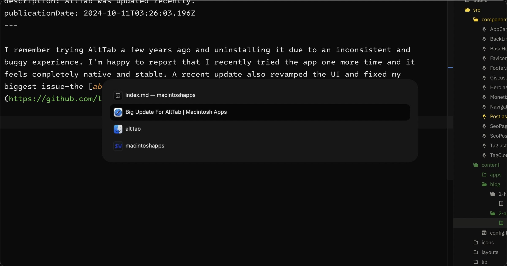

I remember trying AltTab a few years ago and uninstalling it due to an inconsistent and buggy experience. I'm happy to report that I recently tried the app one more time and it feels completely native and stable. A recent update also revamped the UI and fixed my biggest issue—the [ability to vertically align the dialog on the screen](https://github.com/lwouis/alt-tab-macos/issues/585#issuecomment-2403550591)!

 

*Settings: Titles, Small, System, Hide app badges*

 

[Raycast](/apps/raycast) also has a window switcher function built in which I used for a bit. Two things that irked me:

- Raycast window switcher can't use <kbd>⌘ Tab</kbd> like AltTab.
- With Raycast, you have to press the keyboard shortcut (I had it set to <kbd>⌥ Tab</kbd>), focus the app you want, and press <kbd>Return ⮐</kbd>. AltTab works like the native window switcher, where you press the keyboard shortcut and, while continuing to hold <kbd>⌘</kbd>, focus the window you want to swtich to and then release the <kbd>⌘</kbd> key.

A common pain point with macOS is how it handles app switching and window management. With [Rectangle](/apps/rectangle) and now AltTab, macOS users have great alternatives to improve their experience.
